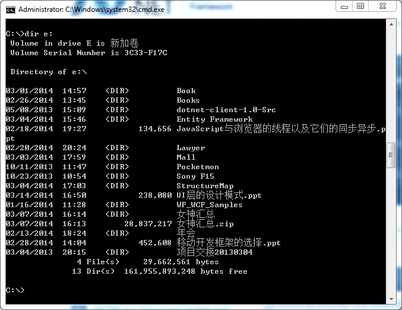
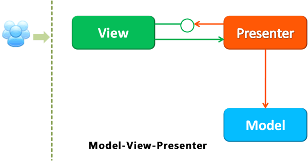
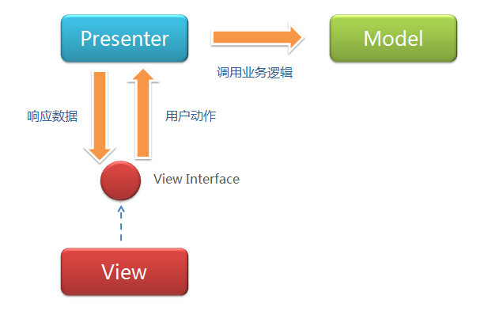

那么我们就按照大致的历史进程将这些概念进行划分：

-	Script
-	Code Blocks、Code Behind
-	MVC、MVP、MVVM

我们知道的是现实的历史发生顺序并不如上，因为思想都是相似的，比如MVC很早很早就出现了，解释型语言至今基本上也有很多分支而且在互联网时代大行其道。

但我要说的是：__不要在意这些细节！__

当然了，这是玩笑，我的意思是，这些内容我懒得应该在另外独立的主题探讨，篇幅也有限。


  

###Script
这里脚本的意思不是指当时是用脚本开发，而是像写脚本一样开发。它们都有一个特点：__功能单一、管理单一、入口单一__。

我们最早的程序是汇编，当时的码农的工作是兼职，工作内容是编写一套寿命不长的机器控制指令，有些甚至是命令，比如至今依然保留的Command（亮点自寻）：



到后来计算机被用于科学计算等，需求推动了需要更高的开发效率，所以我们有了高级语言。

那个时候码农其实多是数学家，程序的作用很简单，就是执行一些数学计算，类似今天ICPC的一些算法问题，比如Hello World：
```c
main()
{
    printf("hello,world\n");
}
```
这时候，程序还可以被归结为输入到输出的过程，我们还能去讲讲冯诺依曼模型。

在这个时代，开发是指编写机器指令，甚至都不配用“开发”这个词来描述这项工作。


  

####软件、UI和Markup Language
在那个时代讲UI等于放屁，根本不存在这种概念。但全赖我们有神器——__摩尔定律__。

但我个人认为摩尔定律是不足以让一个敲命令行的时代在几十年间转变成这种各类框架技术架构实践模式的时代，真正推动计算机形成自有的工程学体系的是还有两样东西就是：

-	__人的能力并没有变强__，至少没有在同级数下变强。
-	__人类一定会物尽其用__

因为人的能力并没有“跟上”机器，所以才会出现各种模式、方法、工具等等来补足人的不足，以最大地透支机器性能。就像我前几天在闪存无聊时突然想到的一句： __架构是对客观不足的妥协，规范是对主观不足的妥协__。

当我们需要机器做的事情多了起来，我们就没办法在一个芯片上解决所有事情，所以才会有冯诺依曼模型、计算机架构，没办法用一台机器解决，所以才要互联网、分布式、云计算。

同样，随着计算机的发展，__要做的事情多了，就出现了软件的概念__。当“开发”正式化，我们需求的软件就变得：__功能繁杂、管理统一、多入口__。

真正变化的不是客观本质，而是需求。就像这里说的“软件入口”在客观上我们还是只有一个，原理上始终都只有一个启动程序、一个启动代码片段。但__“软件的入口”，已经从指代Main函数变成了指代起始UI，用户已经从指代专业人士变成了指代一般消费者，先有软件的需求，才有软件的定义，而需求是在变化的__。

一个软件需要比当时多几个数量级的代码：

-	客观上我们没办法做一个能显示所有代码的显示器
-	主观上我们没办法在超快速滚动中看清所有代码

__所以我们需要添加索引、用多个文件组织代码__。

机器的发展和软件的需求扩大和细化，我们开始出现了用户界面（User Interface）的概念和最适合用于界面的语言——标记语言（Markup Language）。当然，ML不是为UI而生的，它只是十分适合UI，所以才和UI坠入爱河。

__因为有了更高UI的需求，所以代码才正式被分化为描述做什么（业务逻辑）和有什么（UI）的两部分，因为我们开发时没办法在两种思维方式下同时工作，开发时的人脑是单线程的。我们所看到的同时进行UI和逻辑开发只不过是我们学会了在两种模式下快速切换，看起来像同时进行，而不是真正的同时进行。同样的情况也发生在不同的代码片段的开发中__。

分化的情况除了UI，还发生在方方面面，比如数据操作、UI的对象和样式分离，我们还是继续从UI讲下去吧。


  

####Code Block和Code Behind（其实还有Code Inside，比如onclick="javascript:alert('哎呀我*')"）
__UI和逻辑分开了两种语言来写，但是它们也要放在同一个项目中，因为它们原本就是要一起工作的__。即使是分开，也需要相连，因为这是它们本来要解决的问题。

这时候我们出现的（通常的）解决方案就是Code Block和Code Behind。虽然从时间上似乎Code Block比Code Behind要早，有种感觉就是越新越好，但实质上它们正交替地发展着，因为__谁也没办法解决UI和逻辑代码分化后的一个哲学问题——UI和逻辑是一起的，但是它们却不是一起的__。

Code Block能很好地处理UI和逻辑间在一起的关系，你在同一个地方可以同时维护UI和逻辑：

```js
 @model GM.OA.Finance2.Web.Models.FinancialBase.CurrencyModel
 @{
     ViewBag.Title = "EditCurrencyDrawer";
     Layout = "~/Views/Shared/_DrawerLayout.cshtml";
 }
 
 @section styles {
     <link href="/Content/base/table-form.css" rel="stylesheet" />
     <link href="/Content/base/drawer.bigtitle.css" rel="stylesheet/>
}
```

```js
<a href="#" class="addcurrency oa-btn" oa-style="green">添加新币别</a>

<script type="text/javascript">
    $(document).ready(function () {
        $('.addcurrency').click(function () {
            $.oa.drawer.openUrl('AddCurrencyDrawer/', 'addcurrency', {
                width: 300
            });
        });
    });
</script>
```
Code Behind能很好地处理UI和逻辑各自分开的关系，你可以让UI和逻辑各自做好各自的事情：
```C#
<asp:Button ID="RemoveSelectedCurrency_Button" runat="server" Text="删除选中币别" OnClick="RemoveSelectedCurrency_Button_Click" />
<asp:Button ID="RemoveAllCurrencies_Button" runat="server" Text="删除所有币别" OnClick="RemoveAllCurrencies_Button_Click" />
protected void RemoveSelectedCurrency_Button_Click(object sender, EventArgs e)
{
    var currencyId = Currencies_ListBox.SelectedItem.Value;
    currencyManager.Remove(currencyId);
}

protected void RemoveAllCurrencies_Button_Click(object sender, EventArgs e)
{
    currencyManager.RemoveAll();
}
```

__因为存在两种实现方式，所以就存在了对比，因为存在了对比，所以就存在了争论__。就像是Java和.NET、PHP和.NET、WebForm和MVC、Mac OS和Windows、iOS和Android、~~腾讯和所有其他互联网公司~~，等等。

问题不在哪个更好，而是我们要解决什么问题。当然，这听(ben)着(lai)像(jiu)是客气话了。

真正在UI和逻辑分化后带来的实质问题是：

-	是按逻辑和UI划分地管理，还是按单界面的事务进行划分地管理

至少UI和逻辑刚分化的时代，在软件上，我们还认为同一项事务是基于同一个UI的一系列操作完成的。

在摩尔定律还持续发挥作用的时候，计算机领域依旧高速发展，所以__通常我们还在为一样事物争论、思考、辩证的时候，它已经发生了质变了，不变的只是我们要解决的问题__。


  

####事务，以及界面、数据、事件、业务
在之前说到过了，__当需求变得庞大，解决方案也会变得庞大；当解决方案变得庞大，就会出现细分；当出现细分，就会出现按哪种方式管理的问题__。

__软件从处理一件事务发展到了要处理许多事务__，各事务间有包含、顺序、主次等等的关系，变得越来越复杂。因为数据与逻辑庞大了，所以数据与逻辑就分离了，然后事件和业务分离了。

__它们的关系已经在我们还理得清之前持续发展而变得更加难理得清__，但在一个时间点上，它们UI的领域大致分化成这些原子：

-	界面
-	数据
-	事件
-	业务

你要细化的话会有更多繁杂的细节，但相信这么写的话争议性比较小。

__当一个问题出现一次的时候它是一个问题，当一个问题出现了无数次的时候它会成为历史，当一个问题将会出现无数次的时候，它将需要一个明确的定义和解决方案__。

其中，__数据的更新和界面的更新这一特殊事件的问题被放大了无数倍，因为它出现了无数次__。


  
 
####Model-View-Controller
在ASP还在奋斗的时候WebForm突然到来，正如WebForm还在奋斗的时候MVC突然到来。当然，__我这里讲的MVC还是最原始的MVC，因为MVC在我们还在争论的时候已经发展了许多不同分支了__。

有一点相信大家同意的就是，__我们今天讨论争论的MVC、MVP、MVVM、Code Behind等等都源自于职能分化和规划的思想与目的，MVC不是它们的开始，但是一个很好的开始__。

相信MVC的模型大家很熟悉，也很容易找到，我们这里用一下某百科的图：


我们可以看到的是，界面被分到了View，数据分到了载体Model上由Model“携带”，业务集中在Controller中，而推动业务的事件由用户与View交互，通过View向Controller发动。

当然，实现由很多种，每种细节上都有不同，所以我才只讲也只能讲大致的MVC。__MVC的其中一个缺点便是没有明确的定义，所以不同的实现（比如Struts和ASP.NET MVC）细节上都是不一样的__。

我们需要知道的是，__MVC并不是像上面所说的一些事情那样是一种“必然的”结果，它是一系列必然结果问题中的一种解决方案，而且是不完美的解决方案__。我们顺着推理去到一个地方很容易犯的一个错误就是认为路只有这一条而忽视其他可能性（估计这也是导致很多争斗的原因）。另外，我们在讨论一件事物不完美的时候是有一个情境的，所以请不要像“我说它色彩单一，然后你把它涂成彩色后证明我是错的”。

MVC的一般流程是这样的：__View（界面）触发事件--》Controller（业务）处理了业务，然后触发了数据更新--》不知道谁更新了Model的数据--》Model（带着数据）回到了View--》View更新数据__

这里也不多再陈述MVC的原理、实践等等，因为这就太长篇大论了。


  

####Model-View-Presenter和一些衍生
像我们之前推理的，__分化是一种需求的必然结果，但却没有个一个确定的结果__，比如Code Behind和Code Block的问题等等。

MVC顺着需求把UI相关的工作分化成了三份，这点经过实践证明无可厚非。__但是它们的三角关系却被一些人认为带来了一些问题，或者应该说他们有“更好的”解决方案__。

在只有Code Behind和Code Block的那个时候维护是很直接的，不是在同一段代码内解决就是在同一个关联的事件上解决。三角关系的问题就是维护问题。__在MVC，当你有变化的时候你需要同时维护三个对象和三个交互，这显然让事情复杂化了__。

我们之前说到，随着摩尔定律，软件的需求不断地变化和变得庞大。__随着需求变得庞大的时候，需求变化也变得频繁，这是一个出现了无数次以后也将会出现无数的无数次的一个问题，所以它需要一个解决方案，哪怕它不一定能被解决__。

为了解决需求变化，从《人月神话》到敏捷到DDD，__它不是我们已经解决了的问题，而是我们正在解决的问题__。放在UI的模式和MVC上来讲，__就是优化或者替代MVC模式__，其中之一就是Model-View-Presenter（MVP）模式。

我们先看看两个MVP模式的图：

（图一）

（图二）
两幅图是不同的，但是对MVC的改进的思想却是一样的：__切断的View和Model的联系，让View只和Presenter（原Controller）交互，减少在需求变化中需要维护的对象的数量__。

这种方式很符合我们的期待，因为我们倾向于：

-	__用更低的成本解决问题__
-	__用更容易理解的方式解决问题__

许多时候并不是一种模式不好，而是因为人没办法执行，比如不容易理解，我们就会选择容易理解的方式。__计算机依赖摩尔定律用数量的增长来解决问题，而人是用方式的改变来解决问题的__。同样因为客观原因我们不善于维护多个对象和多个对象之间的关系，所以我们改变了，或者说简化了这种方式。

__MVP定义了Presenter和View之间的接口，让一些可以根据已有的接口协议去各自分别独立开发，以此去解决界面需求变化频繁的问题__。上面两图都有接口，不过接口的实现和使用细节不一样，不过思想上是一致的。

在这里要提到的是，事实上，__需求变化最频繁的并不一定是最接近用户的界面，但基本可以确定的是，最接近用户的界面是因为需求变化而需要最频繁更改的__。当然，如果View如果是API而不是UI，那就另说了。

还有一些用来“解决”MVC这项缺点的比如有：ASP.NET MVC的ViewBag，Cocoa的delegate。它们都为了简化数据更新的问题而存在，包括MVVM。


  

####Model-View-ViewModel
先直接看看Model-View-ViewModel（MVVM）的图：


从图上看是比MVP简单了，更不用说MVC了。个人不认为MVVM是从MVP进化而来，我只觉得这是在MVP之后出现的一种“更好的”UI模式解决方案，但是用MVP来与之对比比较容易说明问题。

__ViewModel大致上就是MVP的Presenter和MVC的Controller了，而View和ViewModel间没有了MVP的界面接口，而是直接交互，用数据“绑定”的形式让数据更新的事件不需要开发人员手动去编写特殊用例，而是自动地双向同步__。数据绑定你可以认为是Observer模式或者是Publish/Subscribe模式，原理都是为了__用一种统一的集中的方式实现频繁需要被实现的数据更新问题__。

__比起MVP，MVVM不仅简化了业务与界面的依赖关系，还优化了数据频繁更新的解决方案，甚至可以说提供了一种有效的解决模式__。

至此，我们能理解为什么许多人认为MVVM是最好的一种模式，没有之一。但事实上，__MVVM也是依赖于我们至今所讲的“特有的情境”__。

当然，最优雅的也是第一个能作代表的实践就是Windows Presentation Foundation（WPF）了。


Web
之上，我们在模式演变的推论基本上都还是基于桌面软件的，但是__过去十年却是互联网的时代__。实际上大部分__让大家争议的并不是在桌面领域最合适的是那个，而是在Web领域的模式问题，也就是在B/S场景下的问题__。

当软件离开单机，去到网络的时候，因为场景变了，所以原有的解决方案也变了，不过需求依然是不变的。__我们依然要解决的问题是用户交互与数据更新的问题，还有维护等等的问题__。

当场景变到Web的时候，我们发现__MVVM用来做服务端是极其不适用的，至少现在是不适用的__。而MVP你提都不用提。为什么呢？因为：

-	__网络资源成本过高__
-	__开发成本过高__

问大家一个问题，当一个网页的数据更新后，你希望更新用户看到的数据，你会怎么做？

一般情况下，你会：
```js
window.location.reload();
```
就算你不这么做，用户也会：
```
F5
```
就像之前说的，我们会选择更直接的方式解决问题。直接刷新页面的原因是因为这样更直接，更容易解决数据更新的问题。

很多时候__你不会愿意为了一个数据更新写一个AJAX，更别说这个AJAX要带来Loading、事件顺序处理、网络问题、异常处理等等，这就是开发成本过高__。

另一个网络成本过高就更容易解释了，虽然宽带是基本包月的，但也不带这么用的，何况还有移动用户。更主要的原因是，__在本地软件，更新数据是一个引用问题，而在网络应用上，这是一个传输问题__。传输成本远高于引用成本，引用之上顶多是在本地内存中再进行一次内存拷贝。

这个时候，__我们会更倾向于用MVC模式，因为在Web层面，我们更倾向于一次性更新数据__。


  

####Web的MVVM
所有问题都不是问题，就算有问题也要解决问题。

为什么这个标题下突然冒出这么一句话？我想说的是，__需求依旧是不变的，是推动进步的原动力__。

还有我之前说过，当我们讨论或者争论一个问题的时候，问题的对象已经发生改变了，而且这次是在我们讨论这个问题之前已经发生改变了。

__网络资源成本不断下降__，相信已经不需要多提及。摩尔定律和相近的一些原理正在发挥着它应用的作用，网络带宽越来越高、相应速度越来越快。

__如果传输因为相对成本下降而导致数据传输的成本低于开发人员拒绝客户的成本，那么它就会被实现而不是被拒绝__。

另外还有一点就是__因为技术的进步，技术的资源不断被更大规模地压榨，需求也不断地增长，那么需求始终会增长超过相对不变的开发成本的__。比如jQuery的出现解决了很多问题，我们现在更多地去使用AJAX，哪怕很大一部分依然是为了解决网络资源不足的问题；我们会用更多的样式代码而用了相对更少的图片；我们不再那么依赖Flash一类的矢量图解决方案而直接录制视频。

至少上一节我们说到的两个导致大家选用MVC的问题都正在被解决，所以我们有理由相信未来Web不仅仅需要MVC，可能会需要MVVM或其他解决方案。至少我们能理解容易理解为什么前端会出现一些MVVM的框架，比如先驱knockout.js和AngularJs。这些框架本身的好坏就不作讨论了，因为我们讨论的是模式。

__在Web上，MVVM的对比对象就不是MVC，而是Code Block__。

数据即时更新的需求在扩大，但未必有达到一定要用MVVM这一等级的高大上的模式，实际上如果你要更新一个数据，你还是会采取：
```jquery
$('.notice').html('发送成功！');
```
因为......我们依然会采取更直接的方式解决问题......

__实际上，现在Web MVVM主要并不是用在了Web或者Wap上，而是移动App上__。按照前面的说法，只可能是：

-	HTML+JS比原生在一些场景上更适合Native
-	在移动App上比Web上更适合使用MVVM

哪怕是Native开发，实际上iOS的开发上也是用类似的数据绑定的方式的。这里也不深究了，毕竟我也不算懂iOS。

要说的是，在Web MVVM或者Web的模式上，也就是__Web的富应用上，现在还不过是个初期由膨胀的需求推动的阶段。重要的不是技术会怎么走，而是需求和客观条件会怎么走__。

可能Webform会因为高速开发而焕发第二春，它的AJAX的模式也十分满足于简单开发，但似乎大家需要的不是GUI式的网页。


  

###结尾语
我们不一定需要MVVM，但我们一定需要更强大的方式去解决不断膨胀的Web需求。

我们可以预见的是：

-	会有更强大的浏览器
-	会有更强大的JavaScript或者框架
-	会有更加适合的模式

除去客气话的部分，我还是想说，在不同的需求下其实有最适合的解决方案，__通常让我们纠结的不是因为哪个解决方案更好，而是我们看到的条件不够多__。

编译语言当然比解释语言效率高，但考虑到开发和维护成本，JavaScript等始终会大行其道，比如Node.JS、Python；.NET和微软当然很强大，移植.NET到其他平台也很容易，但微软是家有自己商业模式和要赚钱的公司；当然有些实践和技术更好，但其他开发人员会避开甚至否定自己不擅长的东西，大家都喜欢确定的东西；有些技术更强大，但是只是基于特殊的客观条件和需求，如果你想做大，要么创造客观条件，要么把它结合需求......
