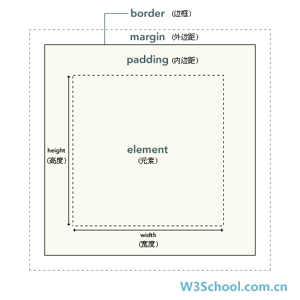
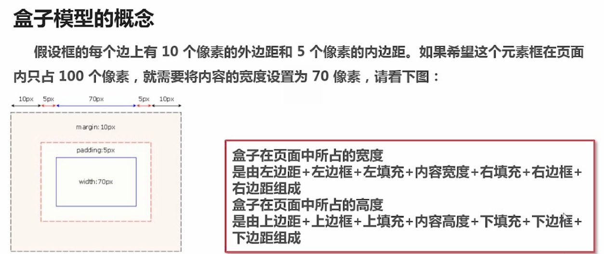
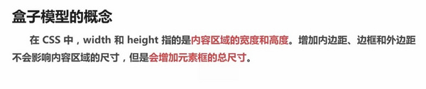
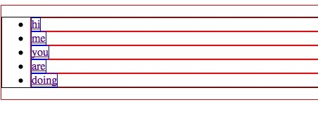
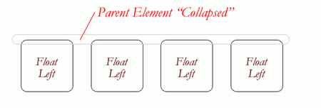
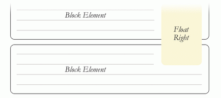

####选择器的分组
-----

CSS选择器分为
```css
1.群组选择器  如：p, body, img, div{}

2.兄弟选择器  如：p + p { color:#f00; }

3.属性选择器  如： p[title] { color:#f00; }

4.包含（后代）选择器  如：body ul li{}

5.子元素选择器 如：div > p{}

6.ID选择器  如：#myDiv{}

7.类选择器  如：.class1{}

8.伪元素选择器  如：E:first-line，E:before

9.伪类选择器  如：E:first-child ，E:visited，E:focus，E:enabled

10.标签选择器  如：p { font-size:1em; }
```
子选择器和后代选择器的区别：
>后代选择器的写法就是把外层的标记写在前面，内层的标记写在后面，之间用空格分隔。
子选择器只对直接后代有影响的选择器，而对“孙子后代”以及多层后代不产生作用。

注意：在IE6中，只支持后代选择器，不支持子选择器

####盒子模型
---
css框模型介绍：





给`ul`下的`li`设置宽度，那么他们将平均掉它们所占容器的宽度。`div >ul> li> a`标签所占宽度和高度：



当你为`body`元素指定`div`时，每个`div`默认的宽为浏览器的100%，高度在每个浏览器的解析都是不一样的，比如在火狐下是131px，在`chrome`下则是142px，具体机制不明

####css字体速记规则
---
当用css定义字体样式的时候，你也许会这样做：
```css
font-weight: bold;
font-style: italic;
font-variant: small-caps;
font-size: 1em;
line-height: 1.5em;
font-family: verdana,sans-serif 
```
没有必要这么做，因为你可以使用css速记属性：
```css
 font: bold italic small-caps 1em/1.5em verdana,sans-serif
 ```
值得注意的是：`css`速记版本只会在你同时指定 `font-size`和`font-family` 属性时才会生效。如果你没有指定`font-weight`, `font-style`,或者 `font-variant`，那么这些值将会自动默认为 `normal`

####避免多余选择器
---
有时候你会有如下的写法：
```css
ul li { ... }

ol li { ... }

table tr td { ... }
```
但实际上这是没必要的写法，因为`<li>`会且只会与`<ul>`或`<ol>`连用，就像`<td>`只能存在于`<tr>`和`<table>`中一样，这儿真没有把它们重复一次的必要。

####!Important
---
所有被`!important `标记的样式，即使它后来被重写，浏览器也只会采用被标记的那条。
```css
 #content{
      height:960px !important;
      height:900px;
} 
```
`!important`： `IE7/IE8/IE9/FireFox`可以识别上面附加`!important`的语句，看到附加`!important`的语句后，就不会再去执行 第二句，尽管他们也“认识”第二句，但是附加“!important”的语句拥有绝对优先级，只要有它存在，第二句就不允许执行。

IE6会执行`!important`的语句后，再去执行第二句`“height:900px”`,用后面的样式覆盖了前面的样式，所以在IE6下，最终的height值是900px。

###@import and`<link>`
---
在决定使用使用哪种方法去包含你的样式表之前，你应该明白这两种方法被用来干嘛？

__链接式__：

link就是把外部CSS与网页连接起来，将其加在`<head>`头部标签中，具体形式如下：
```css
 <link href="styles.css" type="text/css" />
 ```
__导入样式__：

通过两个或以上的`css`文件共同部分，在`css`页面引入`css`文件，通过`@import url（” “）`
```css
@import url("global.css");
@import url(global.css);
@import "global.css";
```
以上三种方式都有效，

区别：
>   1）link属于XHTML标签，而@import是CSS提供的; 
    2）页面被加载的时，link会同时被加载，而@import引用的CSS会等到页面被加载完再加载; 
    3）@import只在IE5以上才能识别，而link是XHTML标签，无兼容问题; 
    4）link方式的样式的权重 高于@import的权重.

####行内元素、块元素和空元素
---

__行内元素特点__

>1、和其他元素都在一行上；
2、元素的高度、宽度、行高及顶部和底部边距不可设置；
3、元素的宽度就是它包含的文字或图片的宽度，不可改变。 

__块级元素特点__

>1、每个块级元素都从新的一行开始，并且其后的元素也另起一行。（真霸道，一个块级元素独占一行）
2、元素的高度、宽度、行高以及顶和底边距都可设置。
3、元素宽度在不设置的情况下，是它本身父容器的100%（和父元素的宽度一致），除非设定一个宽度。

在不设置的情况下，是它本身父容器的100%（和父元素的宽度一致），除非设定一个宽度。

在html中，`<span>、<a>、<label>、<input>、 、 <strong>` 和`<em>`就是典型的行内元素（inline）元素。

块级元素是可以设置宽高的，但是它的实际宽高是本身宽高+padding。block元素要单独占一行。内联元素不单独占一行，给他设置宽高是没有用的。

块级元素和行内元素列表：


__空元素__

知名的空元素： `<br> <hr>  <input> <link> <meta>`

鲜为人知的是： `<area> <base> <col> <command> <embed> <keygen> <param> <source> <track> <wbr>`

####长度单位
---
__em__

`em`为相对长度单位，相对于当前对象内文本的字体尺寸(`font-size`)。比如：Web页面中`body`的文字大小在用户浏览器下默认渲染是`16px`，所以，此时的`1em = 16px`;

__in__

英寸（Inches）。绝对长度单位。
```css
1in = 2.54cm = 25.4 mm = 72pt = 6pc = 96px
```
__pt__

点（Points）。绝对长度单位。
```css
1in = 2.54cm = 25.4 mm = 72pt = 6pc = 96px
```
__small__

``<small>` 标签呈现小号字体效果。

`<strong>`，`<em>`和`<b>`，`<i>`标签

>`<strong>` 标签和 `<em>` 标签一样，用于强调文本，但它强调的程度更强一些。
`em` 是 斜体强调标签，更强烈强调，表示内容的强调点。相当于html元素中的 `<i>...</i>`;
`< b > < i >` 是视觉要素，分别表示无意义的加粗，无意义的斜体。
em 和 strong 是表达要素(phrase elements)。 

__b标签和i标签的区别__

 >b 元素现在描述为在普通文章中仅从文体上突出的不包含任何额外的重要性的一段文本。
  例如：文档概要中的关键字，评论中的产品名。或者代表强调的排版方式。
 i 元素现在描述为在普通文章中突出不同意见或语气或其他的一段文本，
  例如：一个分类名称，一个技术术语，一个外语中的谚语，一个想法等。或者代表斜体的排版方式。

####角度单位
---
__deg__

度（Degress）。一个圆共360度
```css
90deg = 100grad = 0.25turn 
```
__grag__

梯度（Gradians）。一个圆共400梯度
```css
90deg = 100grad = 0.25turn 
```
__turn__

转、圈（Turns）。一个圆共1圈
```css
90deg = 100grad = 0.25turn
```
__rad__

弧度（Radians）。一个圆共2π弧度
```css
90deg = 100grad = 0.25turn
```
####CSS 多类选择器
---
一个 `class` 值中可能包含一个词列表，各个词之间用空格分隔。例如，如果希望将一个特定的元素同时标记为重要（important）和警告（warning），就可以写作：
```css
<p class="important warning">
This paragraph is a very important warning.
</p>
```
对于ID来说，就不能这样写了

####所有浏览器下的CSS透明度
---
元素透明度时常是个恼人的问题，下面这种方式可以实现所有浏览器下的透明度设置：
```css
.transparent {
  zoom: 1;
  filter: alpha(opacity=50);
  opacity: 0.5;
}
```
`Zoom`属性是IE浏览器的专有属性，Firefox等浏览器不支持。它可以设置或检索对象的缩放比例。除此之外，它还有其他一些小作用，比如触发IE的`hasLayout`属性，清除浮动、清除`margin`的重叠等。

当一个元素的 `hasLayout`属性值为true时，我们说这个元素有一个布局（layout）

####css float属性
---
定义和用法

`float` 属性定义元素在哪个方向浮动。以往这个属性总应用于图像，使文本围绕在图像周围，不过在 `CSS `中，任何元素都可以浮动。浮动元素会生成一个块级框，而不论它本身是何种元素。

如果浮动非替换元素，则要指定一个明确的宽度；否则，它们会尽可能地窄。

__注释__：假如在一行之上只有极少的空间可供浮动元素，那么这个元素会跳至下一行，这个过程会持续到某一行拥有足够的空间为止。

__伟大的塌陷__

使用浮动(float)的一个比较疑惑的事情是他们怎么影响包含他们的父元素的。如果父元素只包含浮动元素，那么它的高度就会塌缩为零。如果父元素不包含任何的可见背景，这个问题会很难被注意到



塌陷的直观对立面更不好，看看下面的情况：



__清除浮动__

如果你很明确的知道接下来的元素会是什么，可以使用 `clear:both;` 来清除浮动。这个方法很不错，它不需要 `hack`，不添加额外的元素也使得它有良好的语义性。

使用css 伪选择符(:after)来清除浮动：
```css
.clearfix:after {
                content: ".";
                visibility: hidden;
                display: block;
                height: 0;
                clear: both;
            }
```
####渐进增强与优雅降级
---
>渐进增强 progressive enhancement：针对低版本浏览器进行构建页面，保证最基本的功能，
然后再针对高级浏览器进行效果、交互等改进和追加功能达到更好的用户体验。
优雅降级 graceful degradation：一开始就构建完整的功能，然后再针对低版本浏览器进行兼容。

__区别__

优雅降级是从复杂的现状开始，并试图减少用户体验的供给，而渐进增强则是从一个非常基础的，能够起作用的版本开始，并不断扩充，以适应未来环境的需要。降级（功能衰减）意味着往回看；而渐进增强则意味着朝前看，同时保证其根基处于安全地带。

__“优雅降级”观点__

“优雅降级”观点认为应该针对那些最高级、最完善的浏览器来设计网站。而将那些被认为“过时”或有功能缺失的浏览器下的测试工作安排在开发周期的最后阶段，并把测试对象限定为主流浏览器（如 IE、Mozilla 等）的前一个版本。

在这种设计范例下，旧版的浏览器被认为仅能提供“简陋却无妨 (poor, but passable)” 的浏览体验。你可以做一些小的调整来适应某个特定的浏览器。但由于它们并非我们所关注的焦点，因此除了修复较大的错误之外，其它的差异将被直接忽略。

__“渐进增强”观点__

“渐进增强”观点则认为应关注于内容本身。

内容是我们建立网站的诱因。有的网站展示它，有的则收集它，有的寻求，有的操作，还有的网站甚至会包含以上的种种，但相同点是它们全都涉及到内容。这使得“渐进增强”成为一种更为合理的设计范例。这也是它立即被 `Yahoo!` 所采纳并用以构建其“分级式浏览器支持 (`Graded Browser Support`)”策略的原因所在。

__visibility:hidden和display:none__
```css
display:none  
//隐藏对应的元素，在文档布局中不再给它分配空间，它各边的元素会合拢，
就当他从来不存在。
visibility:hidden  
//隐藏对应的元素，但是在文档布局中仍保留原来的空间。
```
使用CSS `display:none`属性后，HTML元素（对象）的宽度、高度等各种属性值都将“丢失”;而使用`visibility:hidden`属性后，HTML元素（对象）仅仅是在视觉上看不见（完全透明），而它所占据的空间位置仍然存在。