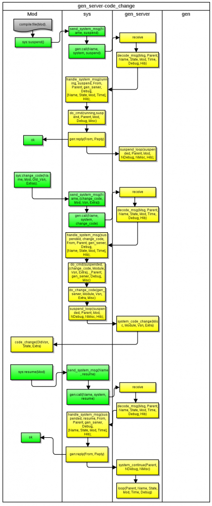

sys 模块主要有两大用途：统计跟踪目标 gen 进程、代码热升级，尤其后者非常重要，下面从 erlang 源码层面来讲述这两大工作原理。


__代码热升级__

代码热升级能做到 gen 进程不停（自然其中已经打开的 socket，file 都不需要关闭，保证100%的在线率）的情况下自动载入新的代码，这点对于其它程序语言来说是件非常难的事情,而对于 erlang 确只是简单几行代码就能解决问题。

__演示代码__

这里有[演示代码](https://github.com/hoterran/erlang-hotswap-example)，你可以自行运行。

####热升级的原理和步骤

1.  首先 gen 进程启动并处于正常工作状态处理业务逻辑，现在需要对代码进行升级，修改原来的内部State状态。
 
1.  修改代码，编译出新的beam文件。  
    ```elrang
    compile:file(Mod).
    ```  
注意不能使用 c(Mod)。 c命令实际包含一个编译、加载、清理老代码作用，这里还不能加载哦, 否则老的内存状态运行在新的代码肯定报错，因为 State 不一致。

1.  利用 sys:suspend 函数使得 gen 进程陷入一种挂起状态  
这种挂起状态的 gen 进程仅仅会处理 system 和 ‘EXIT’ 两类的消息，而不会处理业务逻辑。
    ```erlang
    sys.erl
    ====
    suspend_loop(SysState, Parent, Mod, Debug, Misc, Hib) ->
        case Hib of
        true ->
           suspend_loop_hib(SysState, Parent, Mod, Debug, Misc, Hib);
        _ ->
            receive
            {system, From, Msg} ->
                handle_system_msg(SysState, Msg, From, Parent, Mod, Debug, Misc, Hib);
            {'EXIT', Parent, Reason} ->
                Mod:system_terminate(Reason, Parent, Debug, Misc)
            end
        end.
    ```    
此时业务消息因为不能模式匹配到，都被临时的存在 mailbox 中。

1.  因为业务不会运行了，我们可以放心的清理老代码，载入新代码,
    ```erlang
    code:purge(Mod).
    code:load_file(Mod).
    ```  
好了这个时候已经新的代码了，而 gen 进程里的内存状态还是老状态。

1.  调用 change_code 做一个内存状态的转化
    ```erlang
    sys:change_code(Name, Mod, OldVsn, Extra).
    ```  
change_code 属于 system 消息，告诉 gen 进程去调用 Mod 里的 code_change 函数，针对的 vsn是 OldVsn，额外的参数是Extra，调用 code_change 函数之后，gen 进程内存的 State 在此时进行了转化。

1. 回到业务逻辑
    ```erlang
    sys:resume(Mod).
    ```  
好了代码，内存里的信息都是正确的了，我们就开启业务。

resume 函数最终会让 gen 进程跑到 system_continue 这个函数
```erlang
system_continue(Parent, Debug, [Name, StateName, StateData, Mod, Time]) ->
    loop(Parent, Name, StateName, StateData, Mod, Time, Debug).
```    
于是gen进程又走回到正常的业务逻辑loop函数去，于是积累的消息和新的消息就开始正常的处理了.


release_handler_1.erl 底层也是调用 sys 模块进行代码热升级的，所以理解 sys 的工作原理很重要。

另外 sys:resume 也可以把挂起的进程立即切换回正常模式。

####统计跟踪

-   开启统计
```erlang
sys:statistics(Name, true).
```
实际上是开始记录了一个初始值
```erlang
init_stat() -> 
    {erlang:localtime(), process_info(self(), reductions), 0, 0}.
```
接下来再调用 sys:statistics(Name,get) 就可以获得从开启之后进程的运行时间和处理过的消息数目了。
```erlang
3> sys:statistics(swap_test, get).
{ok,[{start_time,{{2012,7,31},{19,58,25}}},
     {current_time,{{2012,7,31},{19,58,32}}},
     {reductions,18},
     {messages_in,0},
     {messages_out,0}]}
```     
-   关闭统计
```erlang
sys:statistics(Name, false).
```
-   获取进程和进程内字典的信息
```erlang
5> sys:get_status(swap_test).
{status,,
        {module,gen_server},
        [[{'$ancestors',[]},
          {'$initial_call',{swap_test,init,1}}],
         running,,[],
         [{header,"Status for generic server swap_test"},
          {data,[{"Status",running},
                 {"Parent",},
                 {"Logged events",[]}]},
          {data,[{"State",{state,1,2}}]}]]}
```          
最终调用的是 sys.get_status 和 gen 进程里的 format_status/2 函数
```erlang
get_status(SysState, Parent, Mod, Debug, Misc) ->
    {status, self(), {module, Mod},
    [get(), SysState, Parent, Debug, Misc]}.
```    
-   跟踪进程
```erlang
sys:trace(code_lock, true).
```
实际上使得gen进程在处理每一条消息的时候多调用一次 print_event 函数打印出这条信息和前后状态。
```erlang
Debug1 = sys:handle_debug(Debug, {?MODULE, print_event},
    Name, {in, Msg}),
```    
看看激活trace后的效果
```erlang
4> swap_test:test_call().
*DBG* swap_test got call counter from
call counter
*DBG* swap_test sent 1 to , new state {state,3,2}
```
以上就是 sys 模块的重要功能。

[原文链接](http://www.hoterran.info/erlang-otp-sys-sourcecode)
